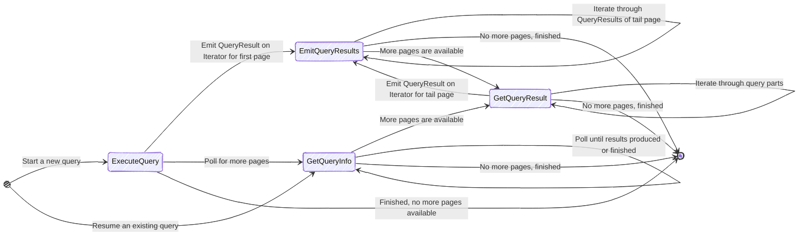
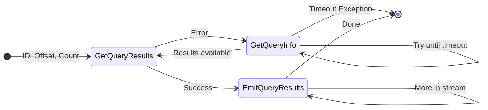

```mermaid
---
config:
  look: handDrawn
---
stateDiagram
    direction LR
    [*] --> ExecuteQuery:Start a new query
    [*] --> GetQueryInfo:Resume an existing query
    ExecuteQuery --> EmitQueryResults:Emit QueryResult on Iterator for first page
    EmitQueryResults --> EmitQueryResults:Iterate through QueryResults of first page
    EmitQueryResults --> [*]:No more pages, finished
    ExecuteQuery --> GetQueryInfo:Poll for more pages
    ExecuteQuery --> [*]:Finished, no more pages available
    GetQueryInfo --> GetQueryResult:More pages are available
    GetQueryResult --> EmitQueryResults:Emit QueryResult on Iterator for tail page
    EmitQueryResults --> EmitQueryResults:Iterate through QueryResults of tail page
    EmitQueryResults --> GetQueryResult:More pages are available
    GetQueryResult --> GetQueryResult:Iterate through query parts
    GetQueryResult --> [*]:No more pages, finished
    GetQueryInfo --> GetQueryInfo:Poll until results produced or finished
    GetQueryInfo --> [*]:No more pages, finished
```

```mermaid
stateDiagram-v2
    direction LR
[*] --> GetQueryResults: ID, Offset, Count
GetQueryResults --> GetQueryInfo: Error
GetQueryInfo --> GetQueryResults: Results available
GetQueryInfo --> GetQueryInfo: Try until timeout
GetQueryInfo --> [*]: Timeout Exception
GetQueryResults --> EmitQueryResults: Success
EmitQueryResults --> EmitQueryResults: More in stream
EmitQueryResults --> [*]: Done
```